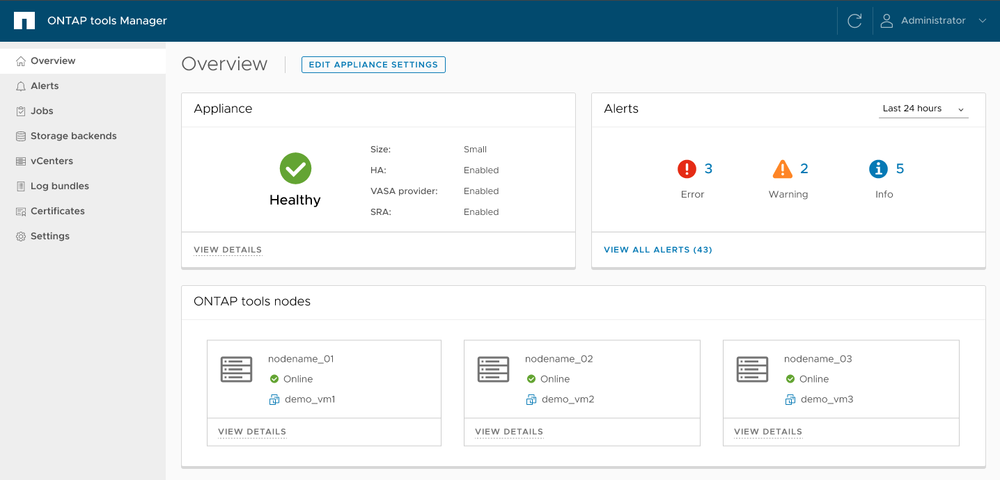

= ONTAP toolTools Manager 使用者介面
:allow-uri-read: 
:icons: font
:imagesdir: ../media/

[role="lead"]
適用於 VMware vSphere 的 ONTAP 工具是可管理多個 vCenter Server 執行個體的多租戶系統。ONTAP 工具管理員可透過託管的 vCenter Server 執行個體和已登入的儲存後端、為 VMware vSphere 管理員提供更多的 ONTAP 工具控制權。

ONTAP 工具管理程式可協助：

* vCenter Server 執行個體管理 - 將 vCenter Server 執行個體新增及管理至 ONTAP 工具。
* 儲存後端管理：將 ONTAP 儲存叢集新增及管理至適用於 VMware vSphere 的 ONTAP 工具、並將其對應至全球已登入的 vCenter Server 執行個體。
* 記錄套件下載：收集適用於 VMware vSphere 的 ONTAP 工具記錄檔。
* 憑證管理 - 將自我簽署的憑證變更為自訂 CA 憑證，並更新或重新整理 VASA Provider 和 ONTAP 工具的所有憑證。
* 密碼管理 - 重設使用者的 OVA 應用程式密碼。

若要存取 ONTAP 工具管理員、請 `\https://<ONTAPtoolsIP>:8443/virtualization/ui/`從瀏覽器啟動、然後使用您在部署期間提供的 VMware vSphere 管理員認證的 ONTAP 工具登入。

ONTAP toolsManager 總覽一節可協助管理應用裝置組態，例如服務管理，節點大小升級和高可用度（ HA ）功能。您也可以監控與節點相關的 ONTAP 工具整體資訊，例如健全狀況，網路詳細資料和警示。

|===
| * 卡片 * | *說明* 

| 應用裝置卡 | 應用裝置卡提供 ONTAP 工具應用裝置的整體狀態。它會顯示應用裝置組態詳細資料及啟用的服務狀態。如需 ONTAP 工具應用裝置的其他資訊，請選取 * 檢視詳細資料 * 連結。當編輯應用裝置設定動作工作正在進行中時，應用裝置 Portlet 會顯示工作的狀態和詳細資料。 

| 警示卡 | 警示卡會依類型列出 ONTAP 工具警示，包括 HA 節點層級警示。您可以選取數量文字（超連結）來檢視警示清單。連結會將您路由至警示檢視頁面，並依選取的類型篩選。 

| ONTAP 工具節點卡 | ONTAP 工具節點卡會顯示節點名稱，節點 VM 名稱，狀態及所有網路相關資料的節點清單。您可以選擇 * 檢視詳細資料 * 來檢視與所選節點相關的其他詳細資料。[ 附註 ] 在非 HA 設定中，只會顯示一個節點。在 HA 設定中，會顯示三個節點。 
|===